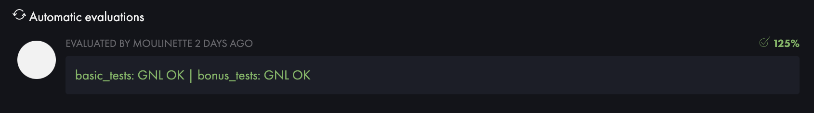

## Index

1. [Sujet](#sujet)
2. [Descriptif - Partie obligatoire](#descriptif---partie-obligatoire) > [get_next_line.c](#get_next_linec) > [get_next_line_utils.c](#get_next_line_utilsc) > [get_next_line.h](#get_next_lineh)
3. [Descriptif - Partie bonus](#descriptif---partie-bonus) > [get_next_line_bonus.c](#get_next_line_bonusc)
4. [Résultat des tests](#résultats-des-tests)

# Sujet
La fonction [get_next_line](#get_next_linec) permet de lire à partir d'un fichier donné, une ligne à la fois, sans perdre la position actuelle dans le fichier. Elle retourne ```1``` si une ligne a été lue avec succès, ```0``` si la fin du fichier a été atteinte et ```-1``` en cas d'erreur.

### Partie obligatoire
- Lire un fichier ligne par ligne.
- Retourner la ligne lue ou ```NULL``` en cas d'erreur ou s'il n'y a plus rien à lire.
- Fonctionner correctement pour la lecture de fichiers ou de l'entrée standard.
- Doit être suivie d'un ```\n```, sauf en fin de fichier sans ```\n```.
- ***get_next_line.h*** doit contenir au moins le prototype de la fonction.
- ***get_next_line_utils.c*** peut contenir des fonctions auxiliaires nécessaires.
- Compilez le programme avec l'option ```-D BUFFER_SIZE=n``` pour spécifier la taille du buffer à utiliser avec read().
- Un ```BUFFER_SIZE``` doit être défini par défaut le cas échéant.
- Le comportement est indéterminé si le fichier a été modifié entre deux appels sans avoir été lu entièrement.
- Bibliothèque ```libft``` interdite.
- Fonction ```lseek()``` interdite.
- Variables globales interdites.

### Partie bonus
- Gérer plusieurs descripteurs de fichier simultanément.
- Lire chacun des fichiers sans perdre les contenus lus.
- ***get_next_line*** doit pouvoir afficher le ```fd``` 3, puis le 4, le 5, puis à nouveau le 3, à nouveau le 4, etc.
- 3 fichiers à ajouter (en + de la partie obligatoire) :
	- **get_next_line_bonus.c**
	- **get_next_line_bonus.h**
	- **get_next_line_utils_bonus.c**

<br>

## Descriptif - Partie obligatoire

#### **[get_next_line.c](./get_next_line.c)**

1. **Inclusion des fichiers nécessaires** :
   - La fonction commence par inclure le fichier d'en-tête **get_next_line.h***, qui contient le prototype de la fonction.
   - Si la macro `BUFFER_SIZE` n'est pas définie, on lui fixe une valeur par défaut de 42 (personnalisable).

2. **Fonction `line_reader`** :
   - Cette fonction est responsable de la lecture du contenu du fichier associé au descripteur de fichier (`fd`) et de la construction de la ligne lue.
   - Un tampon temporaire (`temp`) de la taille `BUFFER_SIZE + 1` est alloué en mémoire.
   - La lecture du fichier se poursuit tant que la ligne actuelle ne contient pas de caractère de nouvelle ligne (`'\n'`) et que la fonction `read` renvoie des octets valides (`bytes > 0`).
   - Les données lues sont stockées dans `temp`, et `temp` est joint à la fin de la ligne actuelle (`line`).

3. **Fonction `extract_new_line`** :
   - Cette fonction extrait la première ligne de `line`, y compris le caractère de nouvelle ligne (`'\n'`) s'il est présent.
   - Elle alloue un nouvel espace en mémoire pour stocker la ligne extraite.
   - La ligne extraite est ensuite retournée.

4. **Fonction `line_remover`** :
   - Cette fonction supprime la première ligne (y compris le caractère de nouvelle ligne) de `line`.
   - Elle alloue un nouvel espace en mémoire pour stocker la ligne restante.
   - La ligne restante est retournée.

5. **Fonction `get_next_line`** :
   - Donction principale qui coordonne les étapes précédentes pour lire une ligne depuis le descripteur de fichier (`fd`).
   - Elle vérifie d'abord que `fd` est valide et que `BUFFER_SIZE` est correctement défini.
   - Elle utilise `read(fd, 0, 0)` pour vérifier que le descripteur de fichier est prêt à être lu.
   - Elle appelle `line_reader` pour lire et construire la ligne actuelle dans `current_line`.
   - Ensuite, elle utilise `extract_new_line` pour extraire la première ligne de `current_line` et la stocke dans `dest`.
   - Enfin, elle utilise `line_remover` pour supprimer la ligne extraite de `current_line`.

<br>

#### **[get_next_line_utils.c](./get_next_line_utils.c)**
1. **`ft_strlen`** (Calcul de la longueur d'une chaîne de caractères)
2. **`ft_strchr`** (Recherche d'un caractère dans une chaîne de caractères)
3. **`ft_strjoin`** (Concaténation de deux chaînes de caractères)

<br>

#### **[get_next_line.h](./get_next_line.h)**
- Header regroupant les prototypes de chaque fonctions.

<br>

## Descriptif - Partie bonus
#### **[get_next_line_bonus.c](./get_next_line_bonus.c)**
1. **Gestion de plusieurs descripteurs de fichiers (fd)** :
   - La fonction `get_next_line_bonus` prend un descripteur de fichier (`fd`) en argument, ce qui lui permet de gérer plusieurs fichiers simultanément. Elle maintient un tableau `current_line` pour stocker les lignes en cours de lecture pour chaque descripteur de fichier.

2. **`static char *current_line[OPEN_MAX]`** :
   - Au lieu d'utiliser une seule variable statique pour stocker la ligne en cours de lecture, on utilise un tableau de pointeurs pour gérer les lignes de plusieurs descripteurs de fichier.

3. **Utilisation de `OPEN_MAX`** :
   - `OPEN_MAX` est une constante système qui représente le nombre maximal de descripteurs de fichiers ouverts simultanément. Cette constante est utilisée pour dimensionner le tableau `current_line` et permettre la gestion de plusieurs descripteurs de fichier.

4. **Appel avec le descripteur de fichier spécifique** :
   - Vous devez appeler `get_next_line_bonus` avec le descripteur de fichier que vous souhaitez lire. Par exemple, `get_next_line_bonus(fd1)` pour le premier fichier, `get_next_line_bonus(fd2)` pour le deuxième fichier, et ainsi de suite.

5. **Stockage séparé pour chaque descripteur de fichier** :
   - Chaque descripteur de fichier a sa propre ligne en cours de lecture stockée dans `current_line[fd]`. Cela garantit que la lecture des différents fichiers n'interfère pas les uns avec les autres.


###### ***Les autres fonctions restent inchangées.***

<br>

## Résultats des tests
#### [gnlTester by Tripouille](https://github.com/Tripouille/gnlTester)


## Résultats de Moulinette

|          Note          |          Tests          |
|:----------------------:|:-----------------------:|
|  |  |